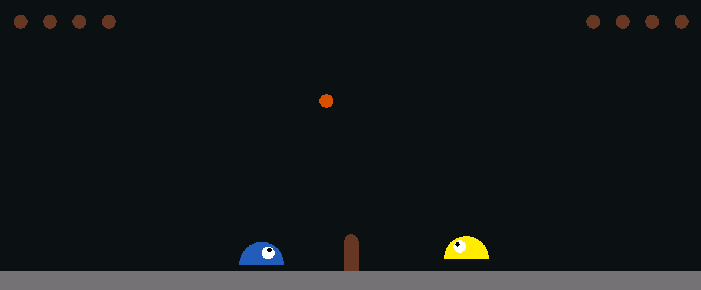
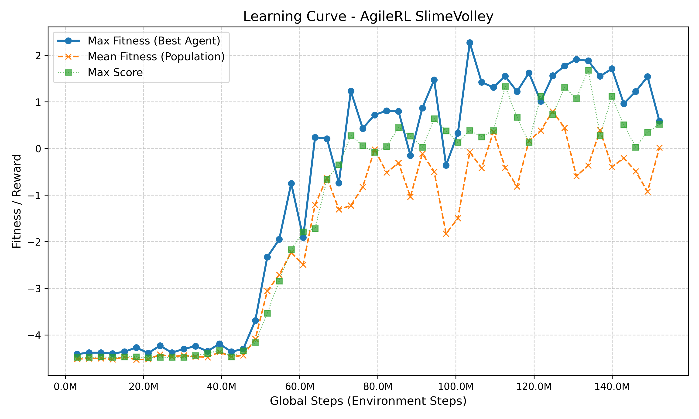

# Reinforcement Learning for Slime Volleyball

This project implements and evaluates a reinforcement-learning agent in the
`SlimeVolley-v0` environment. The environment is a two-dimensional volleyball
game in which an agent must move, jump, and hit the ball over the net. A point
is scored when the opponent loses one of their five lives. Episodes end when a
player loses all lives or after 3,000 environment steps.

The project uses the Gymnasium-compatible version of Slime Volleyball together
with AgileRL's Proximal Policy Optimization (PPO) implementation. During
training, the learned agent plays against the environment's built-in expert
policy.



## Environment

The environment is based on David Ha's original
[`slimevolleygym`](https://github.com/hardmaru/slimevolleygym) repository and
its Neural Slime Volleyball implementation. To integrate it with modern
reinforcement-learning libraries, the environment in this project was
modernized with the assistance of AI tools. In particular, its interface was
adapted to the current [Gymnasium](https://github.com/Farama-Foundation/Gymnasium)
API standard. The local `slimevolleygym` package contains this adapted version.

## Approach

### Observation and action spaces

Each observation is a 12-dimensional vector containing the positions and
velocities of the agent, ball, and opponent:

```text
x_agent, y_agent, vx_agent, vy_agent,
x_ball, y_ball, vx_ball, vy_ball,
x_opponent, y_opponent, vx_opponent, vy_opponent
```

The action space is `MultiBinary(3)`, representing left, right, and jump.

### Reward shaping

The project provides a `SlimeVolleyShaped-v0` variant in addition to the
original sparse-reward environment. The shaped environment:

- gives a small `+0.01` reward when the ball crosses the net;
- treats more than three consecutive touches on one side as a lost point;
- retains the original `+1` reward for winning a point and `-1` reward for
	losing one.

This shaping encourages active play and prevents agents from learning to avoid
losing while endlessly keeping the ball on their own side.

### Training

Training uses PPO with an evolutionary population of agents. AgileRL can mutate
reinforcement-learning hyperparameters and, for populations larger than one,
the network architecture. The initial configuration includes:

- learning rate: `3e-4`;
- mini-batch size: `512`;
- population size: `6`;
- 16 vectorized environments;
- up to 25 million environment steps.

The best reported model evolved a shared network with linear layers of sizes
64, 80, and 32 using ReLU activations. Its evolved hyperparameters included a
learning rate of approximately `9.8e-5`, a batch size of `564`, and a learning
step of `648`.



## Installation

The project requires Python 3.13 or newer and uses `uv` for dependency
management:

```sh
uv sync
```

## Usage

To train an agent with the shaped rewards:

```sh
uv run src/train.py --reward-mode shaped
```

To watch a trained model play against the built-in expert:

```sh
uv run src/play.py \
	--mode baseline_vs_elite \
	--model experts/ppo_slimevolley_shaped_0_23369456.pt
```

The playback script supports these modes:

- `baseline_vs_human`: built-in policy against a human player;
- `elite_vs_human`: trained model against a human player;
- `baseline_vs_elite`: built-in policy against a trained model.

The environment is selected automatically from the model name when a model
containing `shaped` is used. It can also be selected explicitly with
`--env`, for example `--env SlimeVolleyShaped-v0`.

## Results

Training required more than 23 million simulation steps across the population.
The learning curve shows a difficult initial phase followed by consistent wins
against the built-in expert policy. Earlier attempts to train agents entirely
through self-play with independent PPO agents were too computationally
expensive at this stage.

Replacing the built-in expert with a trained agent and continuing the
self-play process is a possible direction for future work.

---

This README is based on [the original project report](docs/slimevolley-sprawozdanie/build/slimevolley-sprawozdanie/slimevolley-sprawozdanie.pdf) (in Polish).